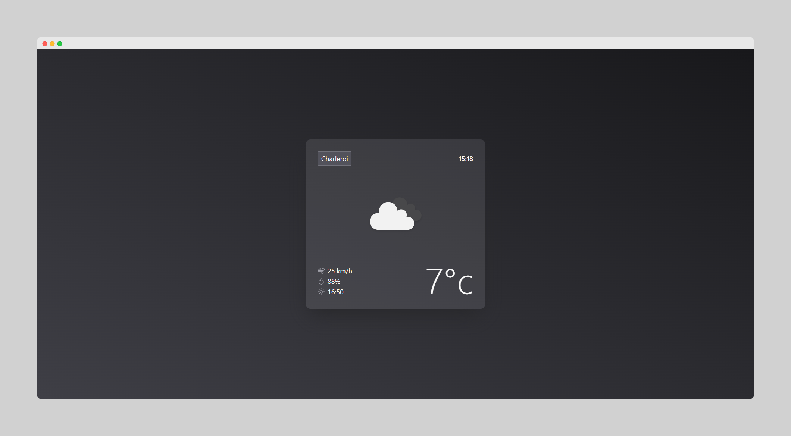

# NextJS Weather App

This application displays the current weather for Charleroi using the OpenWeatherMap API.

## Deployment

The application has been deployed on Vercel.

➡ https://nextjs-weather-app-peach.vercel.app/

## Improvement

- [x] Add an input allowing the user to enter a city.
- [ ] Weather warnings
- [x] Choice of measurement unit (Celsius, Fahrenheit, etc.)
- [ ] Choice of theme (light or dark)
- [ ] ...

## Technologies used

- Next.js
- OpenWeatherMap API
- TailwindCSS
